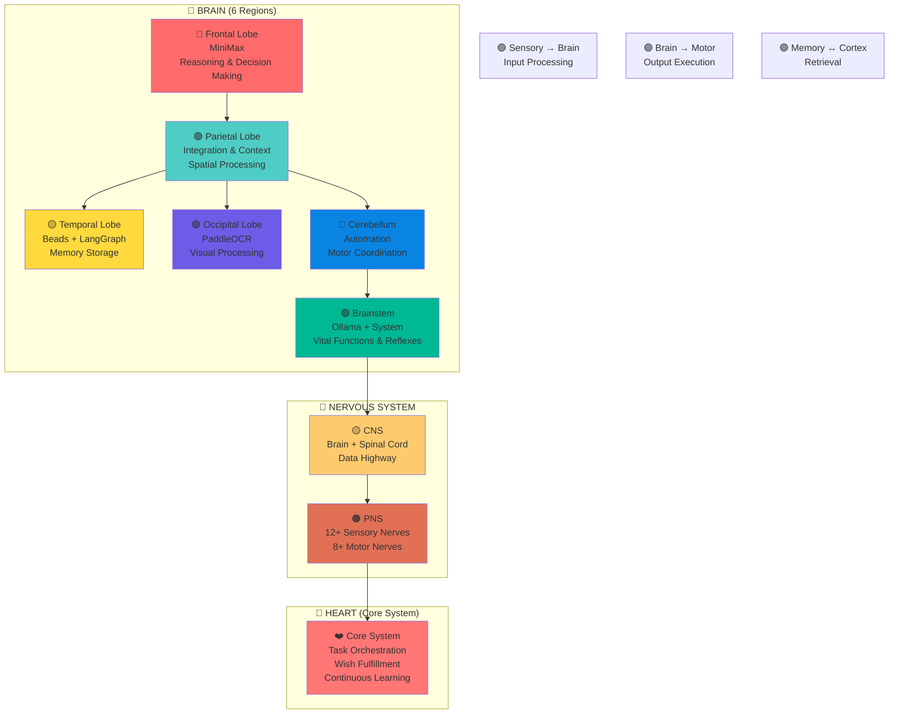

# Harry-001 Brain Architecture Diagram

## Component Details

### Brain Regions (6)
| Region | Color | Function | Technology |
|--------|-------|----------|------------|
| Frontal | 🔴 Red | Reasoning, Planning | MiniMax |
| Parietal | 🟢 Teal | Integration, Context | Task Delegation |
| Temporal | 🟡 Yellow | Memory, Learning | Beads + LangGraph |
| Occipital | 🟣 Purple | Vision, OCR | PaddleOCR |
| Cerebellum | 🔵 Blue | Coordination | Automation |
| Brainstem | 🟢 Green | Basic Functions | Ollama + System |

### Nervous System
- **CNS:** Brain + Spinal Cord (Data Highway)
- **PNS:** 12+ Sensory Nerves (input), 8+ Motor Nerves (output)

### Neural Pathways (5)
1. Sensory → Brain (Input processing)
2. Brain → Motor (Output execution)
3. Memory ↔ Cortex (Retrieval)
4. Reflex Arc (Fast responses)
5. Cortical ↔ Cerebellar (Coordination)

### Heart (Core System)
- Task Orchestration
- Wish Fulfillment
- Continuous Learning

