# Harry-001 Brain Architecture Diagram

```mermaid
graph TB
    subgraph BRAIN["🧠 BRAIN (6 Regions)"]
        F["🔴 Frontal Lobe<br/>MiniMax<br/>Reasoning & Decision Making"]
        P["🟢 Parietal Lobe<br/>Integration & Context<br/>Spatial Processing"]
        T["🟡 Temporal Lobe<br/>Beads + LangGraph<br/>Memory Storage"]
        O["🟣 Occipital Lobe<br/>PaddleOCR<br/>Visual Processing"]
        C["🔵 Cerebellum<br/>Automation<br/>Motor Coordination"]
        BS["🟢 Brainstem<br/>Ollama + System<br/>Vital Functions & Reflexes"]
    end
    
    subgraph NS["🔗 NERVOUS SYSTEM"]
        CNS["🟡 CNS<br/>Brain + Spinal Cord<br/>Data Highway"]
        PNS["🟠 PNS<br/>12+ Sensory Nerves<br/>8+ Motor Nerves"]
    end
    
    subgraph HEART["💓 HEART (Core System)"]
        CORE["❤️ Core System<br/>Task Orchestration<br/>Wish Fulfillment<br/>Continuous Learning"]
    end
    
    %% Data Flow
    F --> P
    P --> T
    P --> O
    P --> C
    C --> BS
    BS --> CNS
    CNS --> PNS
    PNS --> CORE
    
    %% Neural Pathways
    NP1["🟣 Sensory → Brain<br/>Input Processing"]
    NP2["🟣 Brain → Motor<br/>Output Execution"]
    NP3["🟣 Memory ↔ Cortex<br/>Retrieval"]
    
    style F fill:#ff6b6b
    style P fill:#4ecdc4
    style T fill:#ffd93d
    style O fill:#6c5ce7
    style C fill:#0984e3
    style BS fill:#00b894
    style CNS fill:#fdcb6e
    style PNS fill:#e17055
    style CORE fill:#ff7675
```

## Component Details

### Brain Regions (6)
| Region | Color | Function | Technology |
|--------|-------|----------|------------|
| Frontal | 🔴 Red | Reasoning, Planning | MiniMax |
| Parietal | 🟢 Teal | Integration, Context | Task Delegation |
| Temporal | 🟡 Yellow | Memory, Learning | Beads + LangGraph |
| Occipital | 🟣 Purple | Vision, OCR | PaddleOCR |
| Cerebellum | 🔵 Blue | Coordination | Automation |
| Brainstem | 🟢 Green | Basic Functions | Ollama + System |

### Nervous System
- **CNS:** Brain + Spinal Cord (Data Highway)
- **PNS:** 12+ Sensory Nerves (input), 8+ Motor Nerves (output)

### Neural Pathways (5)
1. Sensory → Brain (Input processing)
2. Brain → Motor (Output execution)
3. Memory ↔ Cortex (Retrieval)
4. Reflex Arc (Fast responses)
5. Cortical ↔ Cerebellar (Coordination)

### Heart (Core System)
- Task Orchestration
- Wish Fulfillment
- Continuous Learning

